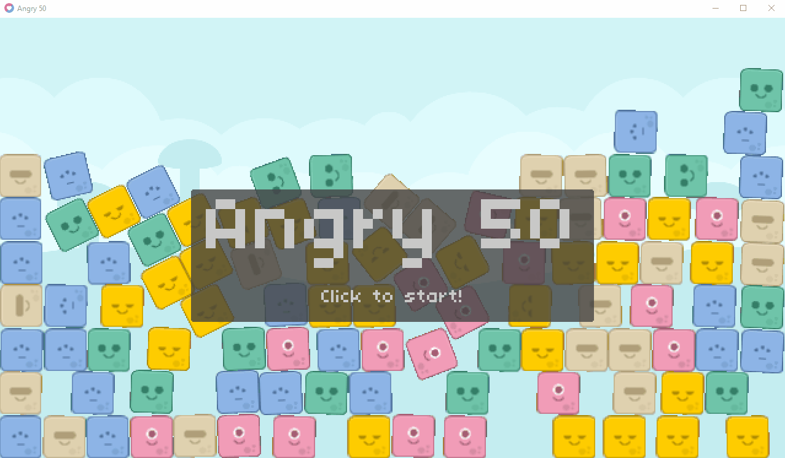

# 🕊️ CS50 — Angry Birds  

[](https://love2d.org/)  
[](https://www.lua.org/)  
[](https://cs50.harvard.edu/games/)  
[](LICENSE)  

**Course:** [CS50's Introduction to Game Development](https://cs50.harvard.edu/games/)  
**Assignment:** Angry Birds — “Three’s Company”  
**Engine / Language:** LÖVE2D (Lua)  

---

## 📋 Project Overview  

This repository contains my implementation of the **Angry Birds** project from CS50’s *Introduction to Game Development*.  

🐥 Built with **LÖVE2D** and **Box2D**, this physics-based projectile game replicates the classic **Angry Birds** experience where players launch Aliens to destroy obstacles and enemies.  

💡 In this version, I implemented the **“Three’s Company”** feature — giving players the ability to **split a launched Alien into three** mid-flight for more strategic gameplay.  

---

### What I Implemented  

- ✔️ **Alien Splitting Mechanic** —  
  - After launching an Alien, pressing **Spacebar** (before it collides with anything) splits it into **three Aliens**.  
  - The **center Alien** continues its original trajectory.  
  - The **upper and lower Aliens** are spawned with slightly altered **linear velocities** and angles for realistic divergence.  

- ✔️ **Collision Flag & Split Condition** —  
  - Added a **collision flag** in `Level.lua` to ensure splitting only occurs **before the first impact**.  
  - Once any Alien collides with an object, the flag is disabled, preventing multiple splits.  

- ✔️ **Launch Marker Behavior Update** —  
  - Updated `AlienLaunchMarker.lua` so the **launch marker resets only when all Aliens** (split or original) **have nearly stopped moving**, ensuring consistent physics handling.  

- ✔️ **Physics Integration** —  
  - Leveraged **Box2D’s linear velocity vectors** to calculate accurate splitting trajectories.  
  - Maintained realistic motion, gravity, and collision effects for all three Aliens.  

---

## 🎬 Gameplay Preview  

  

---

## 🚀 How to Run  

1. **Install LÖVE2D:**  
   Download and install from [https://love2d.org/](https://love2d.org/).  

2. **Clone this repository:**  
   ```bash
   git clone https://github.com/huzaifa-gamedev/cs50-angry-birds.git
   cd cs50-angry-birds
   ```  

3. **Run the Game:**  
   ```bash
   love .
   ```  

---

## 🎯 Controls  

| Key | Action |
|-----|---------|
| **Click + Drag** | Aim and launch Alien |
| **Spacebar** | Split Alien into 3 (before first collision) |
| **R** | Restart level |
| **Escape** | Quit game |

---

## 🧠 Notes on Implementation  

- **Splitting Logic:**  
  Implemented directly in the `Level` class, triggered via `love.keypressed('space')`. Ensures splitting happens only if the **active Alien** has been launched and **has not collided**.  

- **Spawn Offsets:**  
  Created two new Aliens slightly above and below the original Alien’s position using **Box2D world coordinates** and adjusted **linear velocities** for natural spread.  

- **Collision Detection:**  
  Used `World:setCallbacks()` to detect when the **Player Alien** hits any object, setting a `hasCollided` flag to prevent further splits.  

- **Game Reset Condition:**  
  Modified the **launch reset** behavior so the marker reappears only when **all three Aliens** come to rest (near-zero velocity).  

- **Physics Consistency:**  
  Ensured each new Alien inherits the same **fixture, shape, density, and restitution** as the base Alien for consistent simulation results.  

---

## ✨ Credits  

- Original skeleton code & assets: CS50's Introduction to Game Development (Harvard). Licensed under [CC BY-NC-SA 4.0](https://creativecommons.org/licenses/by-nc-sa/4.0/).  

---

## 📄 License  

- This implementation: © 2025 Muhammad Huzaifa Karim. Licensed under the [MIT License](LICENSE).  

For more details, see [ATTRIBUTION.md](ATTRIBUTION.md).  

---

## ✍️ Author  

**Muhammad Huzaifa Karim**  
[GitHub Profile](https://github.com/huzaifakarim1)  

---

## 📬 Contact  

For feedback, collaboration, or project ideas, feel free to connect via [GitHub](https://github.com/huzaifakarim1).  

---

© 2025 Muhammad Huzaifa Karim. All rights reserved.  
